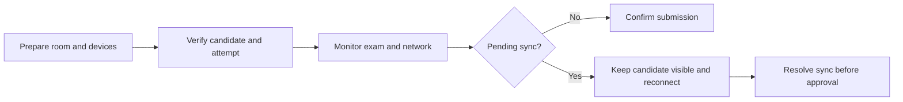

# CBT Invigilation, Offline Resilience and Pending Sync

EduEdge CBT uses server timing with browser answer saving and reconnection sync. Invigilators must protect both examination integrity and valid offline answers.

## Operating procedure

1. Confirm power, approved browser, network, candidate list and seating.
2. Verify the student and ensure only one valid active attempt exists.
3. Monitor focus violations, device changes and network state.
4. Do not ask a student to create a duplicate attempt after disconnection.
5. Keep pending-sync candidates visible until the server confirms all answers.
6. Block result approval until unresolved pending answers are formally handled.

## Practice Exercise

Describe the actions required when three students lose network access, continue answering locally and finish before connectivity returns.
