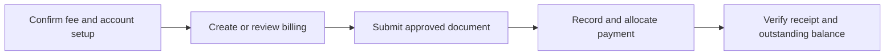

# Bursary Fees, Receipts and Student Accounts

School billing must preserve ERPNext accounting truth. Submitted invoices and payments are not edited to make reports look correct.

## Operating procedure

1. Confirm company, branch, cost centre, receivable, income, discount and write-off defaults.
2. Check the student, academic period and fee components before submission.
3. Record payment with the correct date, mode, bank or cash account and reference.
4. Allocate the payment to the correct invoice or fee liability.
5. Issue a receipt only after confirming the submitted payment and remaining balance.

## Accounting safety

- Do not mutate a submitted invoice.
- Correct errors through a safe draft, cancellation and replacement, credit note, write-off or payment reallocation as appropriate.
- Do not treat a bank alert as a completed allocation.

## Practice Exercise

Explain how to handle a parent who paid part of a fee, then used the wrong reference for the balance.
