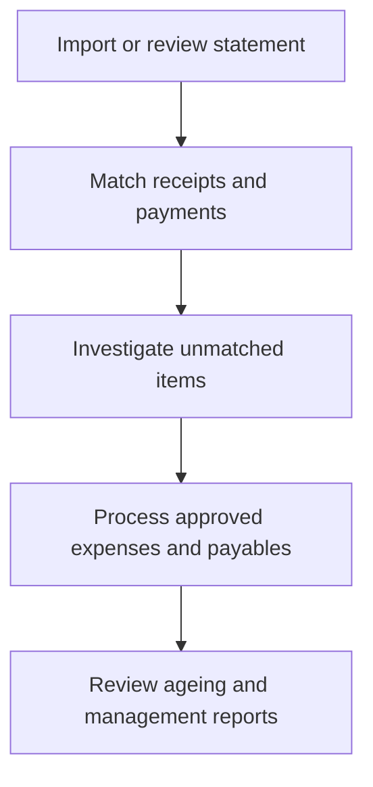

# Bank Reconciliation, Payables and Financial Reporting

Reconciliation proves that school records agree with bank, cash and supplier evidence. Unmatched items must remain visible until resolved.

## Operating procedure

1. Match bank transactions to submitted Payment Entries or other valid accounting documents.
2. Investigate duplicate, short, excess, reversed or unidentified payments.
3. Process supplier invoices only with approved supporting documents and correct cost centres.
4. Review receivables and payables ageing before collection or payment decisions.
5. Prepare branch-aware financial reports and disclose unresolved reconciliation items.

## Controls

- Never create a balancing entry merely to force reconciliation.
- Open source documents before approving or correcting a transaction.
- Keep supplier, expense and bank duties appropriately separated.

## Practice Exercise

Prepare a resolution plan for one unidentified bank credit, one duplicate receipt and one overdue supplier invoice.
