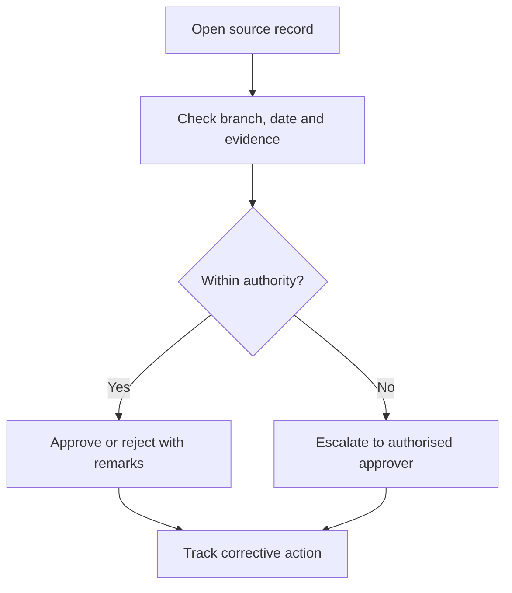

# School Management Approvals, Reports and Audit Follow-up

An approval is a decision supported by source records, delegated authority and an audit trail.

## Operating procedure

1. Open the underlying document before relying on a dashboard summary.
2. Check branch, company, dates, owner, workflow state and evidence.
3. Confirm that the decision falls within delegated authority.
4. Approve, reject or return with clear remarks.
5. Track corrective actions, owners and due dates until closure.

## Reporting discipline

Use consistent filters when comparing academics, attendance, finance, staffing, safety and operations. Explain exclusions and unresolved items.

## Practice Exercise

Review a hypothetical expense variance, attendance decline and unresolved safety incident. State who should decide each issue and what evidence is required.
