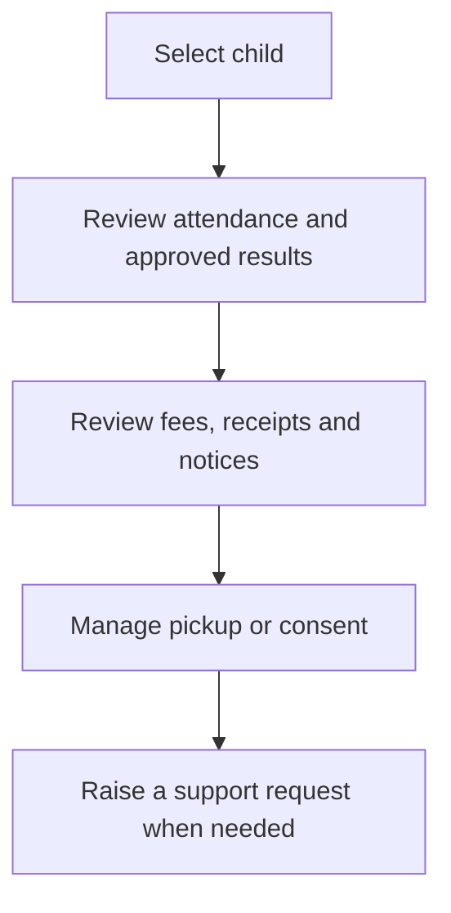

# Parent Portal Daily Use

The Parent Portal should show only verified children and approved school information. Some buttons become available only when the school activates the related module.

## Daily use

1. Select the correct child before opening attendance, results, fees or notices.
2. Review only approved results and published report cards.
3. Check fee references, receipt status and the school’s verified payment instructions.
4. Update pickup authority only through the approved workflow; do not send informal instructions through unrelated staff.
5. Use the school support channel for wrong records, missing payments or urgent safety concerns.

## Safe boundaries

- Parents cannot edit academic results or attendance records.
- A payment alert is not proof of allocation; confirm the official receipt and outstanding balance.
- Do not authorise pickup by sharing screenshots or passwords.

## Practice Exercise

- Locate each linked child.
- Identify where an approved result and official receipt will appear.
- Describe the correct action when a payment or pickup record is wrong.
