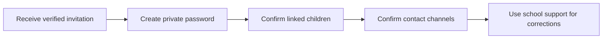

# Parent Portal Orientation and Account Safety

Use the Parent Portal only with the account issued to you by the school. One verified parent or guardian account may be linked to more than one child.

## Step-by-step guide

1. Open the invitation sent to your verified email address or phone number.
2. Create a password that is not shared with children, drivers, domestic staff or other parents.
3. Confirm every linked child: full name, school, branch, class and your relationship.
4. Confirm the phone number and email used for notices, OTPs and urgent communication.
5. Report a missing child, duplicate child or wrong relationship to the school administrator.

> Do not create a second account to solve a linking problem. Duplicate accounts make consent, pickup and payment records unsafe.

## Practice Exercise

- Confirm the names and branches of all children linked to the account.
- Identify the school contact for portal corrections.
- Explain why passwords and OTPs must not be shared.
