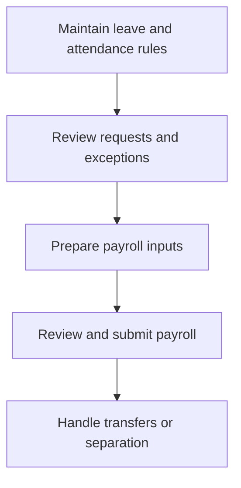

# HR Leave, Attendance and Payroll Operations

This module is available only when Frappe HRMS, Leave Application and Salary Slip are installed.

## Operating procedure

1. Confirm leave types, allocations, holidays and approvers.
2. Resolve attendance exceptions and approved absences before payroll.
3. Review salary structures, deductions, statutory items and bank details.
4. Submit payroll only after authorised review and variance checks.
5. Process transfers and exits with final payroll, access revocation and asset clearance.

## Controls

- Do not expose salary information to unauthorised staff.
- Do not change submitted salary slips to hide an error; use the supported correction process.
- Separate payroll preparation, approval and payment where staffing permits.

## Practice Exercise

Describe the checks required before paying a staff member who changed branch, took unpaid leave and changed bank details in the same month.
