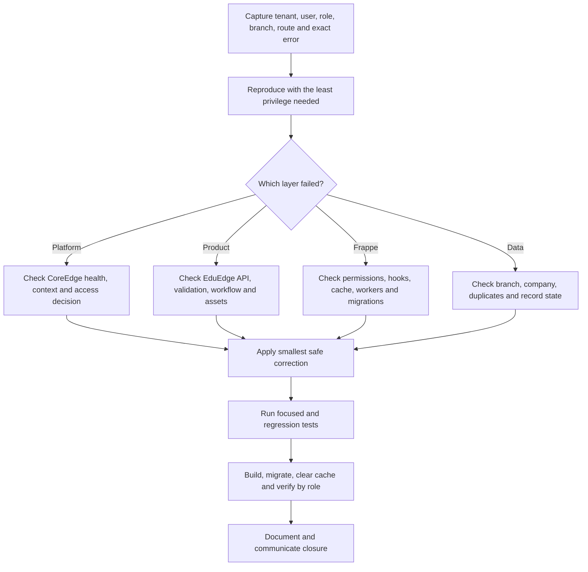

# ProcessEdge Support, Diagnostics and Upgrades

Support work must preserve ERPNext accounting truth, Frappe permissions, EduEdge academic truth, branch isolation, and CoreEdge access controls. Avoid broad rewrites when a focused correction is sufficient.

## Diagnostic flow

## Capture useful context

Record the site, user role, active branch, route, document state, time, exact action, error text, browser console details, network request, and relevant server log. Remove passwords and secrets before sharing evidence.

## Protect business truth

- Do not mutate submitted accounting documents.
- Do not rewrite approved or published academic evidence without an authorised correction workflow.
- Do not bypass branch or tenant checks to make a test pass.
- Use permission-aware APIs and idempotent patches.

## Upgrade sequence

1. Review repository status and current branches.
2. Back up the site and confirm recovery ownership.
3. Pull only the intended branch or merged main line.
4. Build required apps in dependency order.
5. Run migration and clear caches.
6. Run focused tests and relevant regressions.
7. Verify browser behaviour for affected roles and branches.
8. Record files changed, tests, migrations, risks, and follow-up work.

## Closure

Confirm the client-visible result, not merely that a command succeeded. State any skipped tests or cloud-only verification clearly.

## Practice Exercise

- Diagnose a simulated missing-product-bundle error without changing business data.
- Explain how to distinguish CoreEdge denial from an EduEdge permission error.
- Write an upgrade checklist for EdgeSuite UI and EduEdge.
- Produce a concise closure note listing tests, migrations, risk, and remaining QA.
