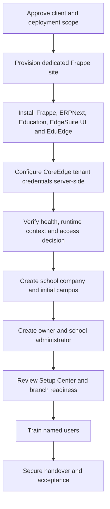

# ProcessEdge Tenant Provisioning and Handover

ProcessEdge Super Administrators provision and support EduEdge without installing CoreEdge inside every product site. Each unrelated school customer should normally receive a dedicated Frappe site, while campuses remain branch records inside that tenant.

## Provisioning flow

## Site and dependency boundary

Do not place unrelated schools in one site and depend only on Company filtering. Do not install CoreEdge merely to satisfy local imports. EduEdge should call CoreEdge services through documented APIs.

## CoreEdge configuration

Configure tenant key, client ID, client secret, base URL, health path, runtime context path, access decision path, and fail-closed policy in server-side site configuration. Never expose the client secret through boot data or browser APIs.

## Bootstrap the school

Create the initial company and campus, then validate company-linked accounting defaults. Create the school owner/System Manager and named school administrator. Assign branch access deliberately.

## Handover

The handover should include:

- live URL and deployment scope;
- secure credential transfer outside general documentation;
- role and branch responsibility matrix;
- training completion expectations;
- support contacts and escalation boundaries;
- backup, domain, hosting, and subscription ownership;
- acceptance and outstanding items.

## Practice Exercise

- Prepare a sample site-provisioning checklist.
- Show where CoreEdge credentials belong and where they must never appear.
- Configure a test company, campus, owner, and school administrator.
- Produce a handover checklist without writing passwords into the training document.
