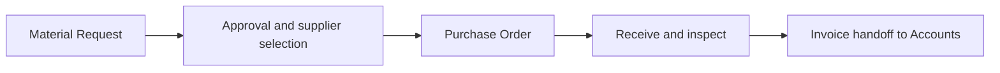

# School Procurement and Supplier Workflow

Procurement should begin with an approved need and end with matched request, order, receipt and invoice evidence.

## Operating procedure

1. Raise a Material Request with branch, purpose, items, quantities and required date.
2. Obtain approval and use authorised supplier and price evidence.
3. Create the Purchase Order with the correct company and delivery location.
4. Receive and inspect quantities, condition and supporting documents.
5. Hand matched documents and explained variances to Accounts.

## Controls

- Requesters should not approve their own exceptional purchases.
- Do not receive goods that were not delivered.
- Do not split purchases to avoid approval limits.

## Practice Exercise

Map the documents needed to buy laboratory consumables for two campuses while keeping each branch’s costs separate.
