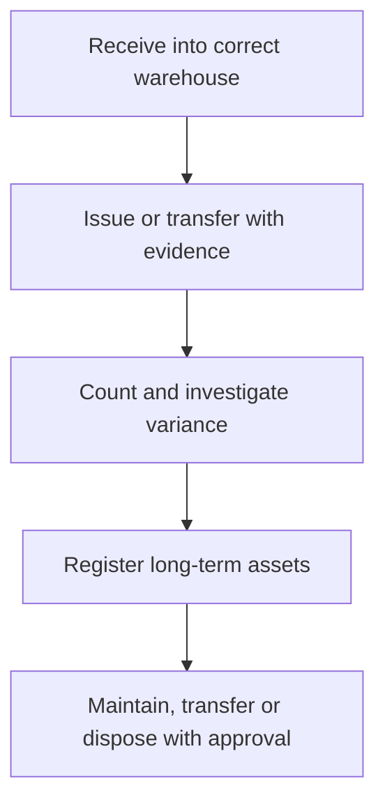

# Stores, Inventory and School Asset Control

Stock and assets must remain traceable to the correct company, branch, warehouse, location and custodian.

## Operating procedure

1. Confirm the branch and warehouse before any stock movement.
2. Record receipts, issues and transfers with the receiving person or destination.
3. Perform controlled stock counts and investigate differences before adjustment.
4. Register qualifying assets with location, custodian, value and maintenance details.
5. Transfer or dispose assets only through authorised approval.

## Controls

- Do not mix unrelated campuses in one operational warehouse without an approved design.
- Physical custody and system quantity should be reconciled regularly.
- Missing or damaged assets require an incident and accountable follow-up.

## Practice Exercise

Explain how to issue textbooks to a department, count the remaining stock and record a damaged laptop assigned to a teacher.
