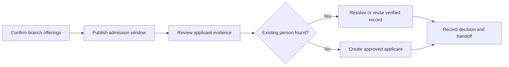

# Registrar Admissions and Applicant Records

Registrar work begins with the correct branch, academic year and programme offering. Do not use one admission record for unrelated campuses.

## Operating procedure

1. Confirm the campus and academic year.
2. Confirm active Programme Offerings marked available for admission.
3. Publish a branch-specific Student Admission with at least one valid programme.
4. Search before creating an applicant or student.
5. Review names, contacts, previous-school details and required evidence.
6. Record the decision using the approved workflow and preserve remarks.

## Controls

- Do not approve an application with unresolved identity or programme conflicts.
- Do not delete rejected applications merely to remove them from a report.
- Escalate suspected duplicates instead of guessing.

## Practice Exercise

Create a sample admission for one campus, select two valid programmes and explain how an applicant moves from application to enrolment.
