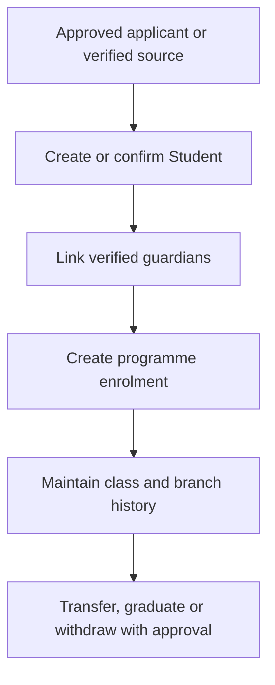

# Student Enrolment, Transfers and Record Lifecycle

A student record is a long-term identity record. Class, programme and branch changes should create history rather than erase it.

## Operating procedure

1. Start from an approved applicant or another verified source.
2. Search for an existing Student before creating a new one.
3. Link verified Guardian records and confirm portal contact details.
4. Create the correct programme enrolment for the academic period and branch.
5. Use approved transfer or progression actions instead of overwriting historical placement.
6. Record graduation, withdrawal or transfer evidence before issuing documents.

## Role boundaries

- Registrar maintains identity and enrolment evidence.
- Teachers maintain teaching records, not student identity.
- Finance confirms financial clearance where required.
- School management approves exceptional transfers or releases.

## Practice Exercise

Describe how to process a student transferring from one campus to another without losing the previous campus history.
