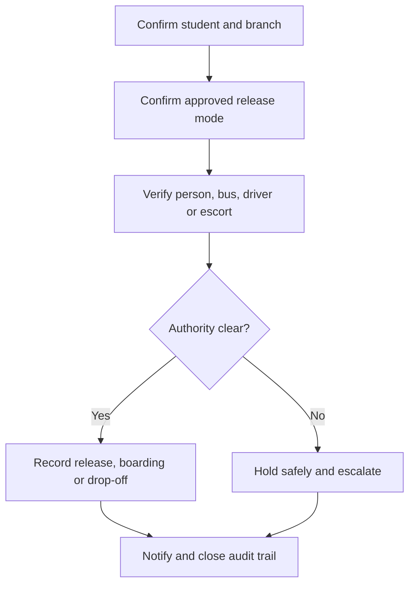

# Student Safety, Pickup and Incident Control

A student must be released only through an approved mode with verified authority and a complete handoff record.

## Release modes

- Parent or Guardian Pickup
- Authorised Pickup Person
- School Bus
- Staff Escort
- Emergency Pickup
- Self-Exit where age and school policy permit

## Operating procedure

1. Confirm the student, branch, gate and approved release mode.
2. Verify identity and relationship, or confirm bus, route, driver and attendant.
3. Record boarding, release or drop-off with time and responsible staff.
4. Notify the approved parent or guardian where policy requires.
5. When authority is unclear, keep the student safe and escalate; do not improvise.
6. Record incidents, decisions and final resolution.

## Practice Exercise

Explain how to handle an unlisted adult arriving for pickup while the parent’s phone is unreachable and the school bus is about to leave.
