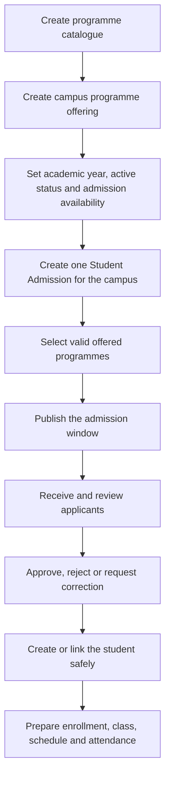

# Programmes, Admissions and Academic Operations

Admissions must follow the branch-specific academic structure. A programme can exist in the school catalogue without being available at every campus or in every academic year.

## Admission setup flow

## Programme catalogue and offerings

The Programme master defines the school’s stable programme identity. EduEdge Programme Offering defines where and when that programme is available. Select only active, admission-enabled offerings for the campus and academic year.

## Create separate admission records per campus

Use one Student Admission document per branch or campus. Staff with access to multiple campuses may create multiple records, using clear titles such as:

- `2026/2027 Admission - Ikeja Campus`
- `2026/2027 Admission - Lekki Campus`

Do not combine unrelated campuses into one admission record.

## Process applicants

Confirm the selected programme, campus, academic year, applicant identity, and supporting information. Search before creating a Student to avoid duplicates. Use the approved enrollment process after acceptance.

## Prepare academic operations

After students are enrolled, configure Student Groups, rooms, course schedules, instructor assignments, and attendance responsibility for the correct campus.

## Practice Exercise

- Create or review one Programme.
- Create an active, admission-enabled Programme Offering for a test campus and academic year.
- Create a branch-specific admission and select the offered programme.
- Explain how you will prevent duplicate Student records during applicant conversion.
