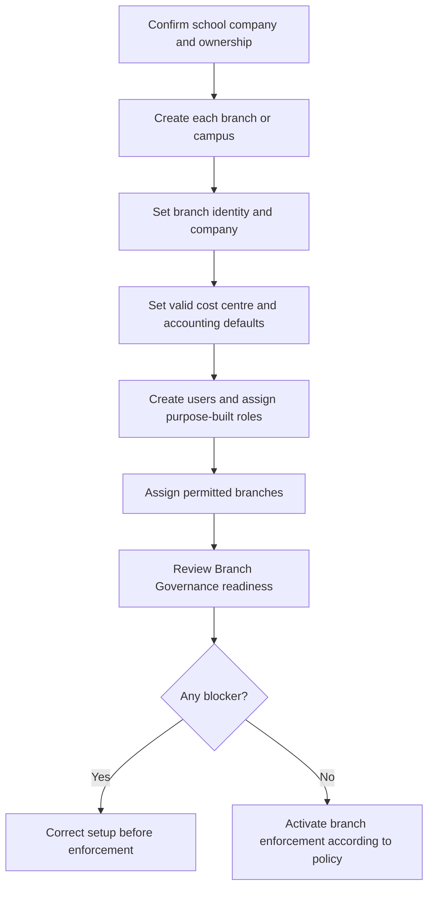

# School Foundation, Branches and Staff Access

School administrators should complete foundation setup in a controlled sequence. Branch identity, company context, accounting defaults, and staff access affect every later workflow.

## Recommended setup sequence

## Use Setup Center first

Setup Center is the guided readiness view. Resolve blockers in sequence instead of opening every master and guessing what is required.

## Configure each campus

For every branch or campus, confirm:

- branch name and code;
- company;
- location and contact identity;
- default cost centre;
- applicable income, receivable, payment, discount, write-off, or expense defaults;
- operational status.

Accounting defaults must belong to the correct company and have the correct account type. EduEdge readiness checks should not be bypassed.

## Assign staff safely

Use the smallest role and campus scope required. Avoid giving all staff System Manager access. A multi-campus employee can receive multiple explicit branch assignments and choose an active working campus.

## Activate enforcement only when ready

Before strict branch enforcement, verify that every operational user has a valid assignment and that default campus or HQ scope is unambiguous. Keep a recovery administrator available.

## Practice Exercise

- Review Setup Center and identify one blocker and one warning.
- Open a campus and verify company and cost centre.
- Create a sample branch assignment for a permitted test user.
- Explain why enforcement should not be activated before assignment coverage is complete.
