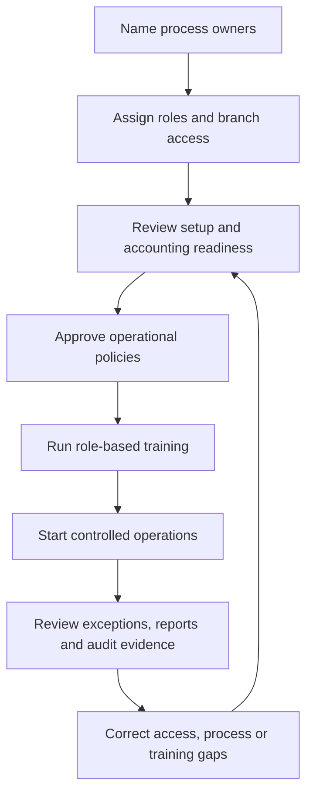

# School Ownership, Governance and Readiness

The school owner or System Manager is accountable for who can do what, which campuses are operational, who approves sensitive changes, and whether the school is ready to rely on EduEdge for daily work.

## Governance cycle

## Appoint responsible owners

Assign named responsibility for:

- school and campus setup;
- admissions and applicant review;
- academic operations and attendance;
- assessments, result approval, and publication;
- finance and accounting configuration;
- CBT and invigilation;
- student safety and pickup operations;
- platform access and support escalation.

## Use role separation

System Manager should remain limited to trusted owners or senior administrators. Teachers, bursars, invigilators, and safety officers should receive purpose-built roles and branch assignments.

## Review readiness

Review Setup Center and Branch Governance before rollout. A warning may be accepted with a documented plan; a blocker should normally stop operational activation until resolved.

## Approvals and accountability

Define who may approve results, publish report cards, activate branch enforcement, change accounting defaults, create administrators, and request ProcessEdge support. Keep evidence of material decisions.

## Practice Exercise

- List the named owner for each critical EduEdge process.
- Review the current branch-governance blockers.
- Identify every user holding System Manager and justify the access.
- Agree the date and owner of the next access review.
