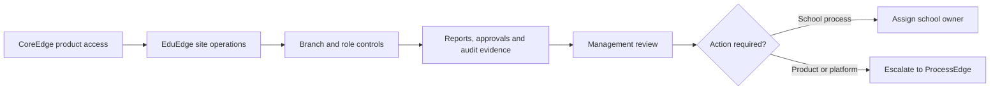

# Platform Access, Reporting and Support Oversight

EduEdge operates as a product application connected to shared CoreEdge platform services. The school owner should understand the commercial, operational, security, and continuity responsibilities without managing technical secrets directly.

## Oversight flow

## Platform responsibility

Know the responsible contacts for subscription and activation, domain ownership, hosting, backups, recovery, support, training, and change approval. Service credentials must remain server-side and should not be copied into user training materials.

## Reporting discipline

Use date, branch, company, class, programme, status, and approval filters appropriately. Open source records before acting on a summary. Separate executive overview from daily operational investigation.

## Audit and approval evidence

Review access assignments, result publication logs, report-card approvals, progression decisions, setup changes, and support interventions. Do not rely only on verbal confirmation for material changes.

## Continuity

Agree how the school will respond to internet outages, user lockout, incorrect branch context, suspected data exposure, failed backups, or CoreEdge access suspension. Keep current contacts and escalation expectations.

## Practice Exercise

- Identify the owner of hosting, domain, backups, and subscription access.
- Open one management report and trace a figure to its source record.
- Locate one approval or audit log relevant to school operations.
- Describe the escalation route for a platform-access failure.
