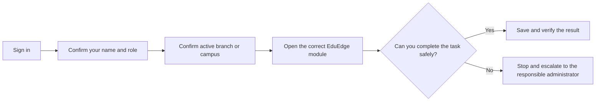
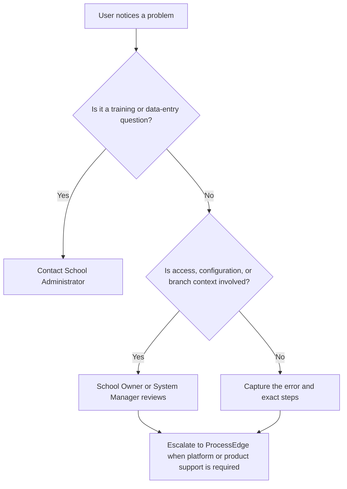

# EduEdge Orientation and Safe Navigation

EduEdge gives each user a guided view of the work they are permitted to perform. The visible menu improves usability, but Frappe roles, branch assignments, backend validation, and CoreEdge access decisions remain the real security controls.

## Learning outcome

By the end of this module, you should be able to identify your role, confirm the active campus, navigate the EdgeSuite shell, and escalate a problem safely.

## Standard navigation flow

## The EdgeSuite shell

- **Product sidebar:** opens EduEdge operational pages while EduEdge is in focus.
- **Branch context:** shows the campus currently controlling branch-aware records and reports.
- **Notifications:** surfaces work assigned to you; it does not grant permission by itself.
- **Profile menu:** confirms the signed-in user and provides normal account actions.
- **Product waffle:** remains available across Desk, but native ERPNext/Frappe navigation returns outside an EdgeSuite page.

## Safe-use rules

1. Never use another person’s account.
2. Never change the active campus casually before entering operational data.
3. Do not create duplicate students, programmes, users, classes, or branches because a record is difficult to find.
4. Do not bypass approval, publication, payment, or access controls.
5. Do not share passwords, API credentials, examination links, or screenshots containing personal data.
6. When unsure, stop and ask the responsible school administrator.

## Support path

## Practice Exercise

- Confirm your displayed user name.
- State your primary EduEdge responsibility in one sentence.
- Identify the active campus or confirm that no operational campus is selected.
- Open the product waffle, then close it with Escape.
- Explain who you will contact if your profile or branch is wrong.
