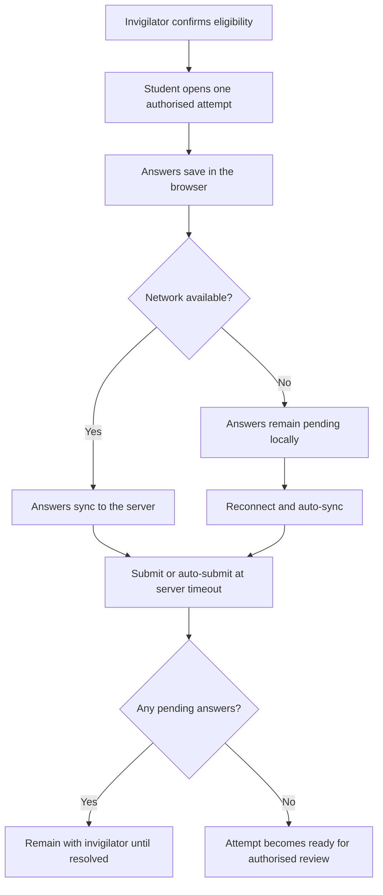

# CBT, Pending Sync, Results and Report Cards

EduEdge CBT is designed to remain resilient when a student’s internet connection becomes unstable. The server remains the authority for examination timing and final submission.

## Examination flow

## Before the examination

- Charge the device and use the browser approved by the school.
- Arrive early enough for identity and eligibility checks.
- Open only one attempt.
- Do not refresh repeatedly, open extra tabs, or use another device unless the invigilator instructs you.

## During the examination

EduEdge may save answers locally before they reach the server. A network warning does not mean your answers are lost, but it does mean you must remain on the examination page and follow invigilator instructions.

Do not close the browser while answers are pending sync. Do not begin a duplicate attempt.

## After submission

A submitted examination may still require authorised review or result approval. Students should view only results and report cards that the school has published.

## Result questions

Use the school’s review process. A teacher may clarify a score, but only authorised staff should approve, reject, or publish results.

## Practice Exercise

- Explain the difference between local answer saving and server sync.
- State what you should do when the page shows pending sync.
- Explain why opening a duplicate attempt is unsafe.
- Identify who you should contact about a published result question.
