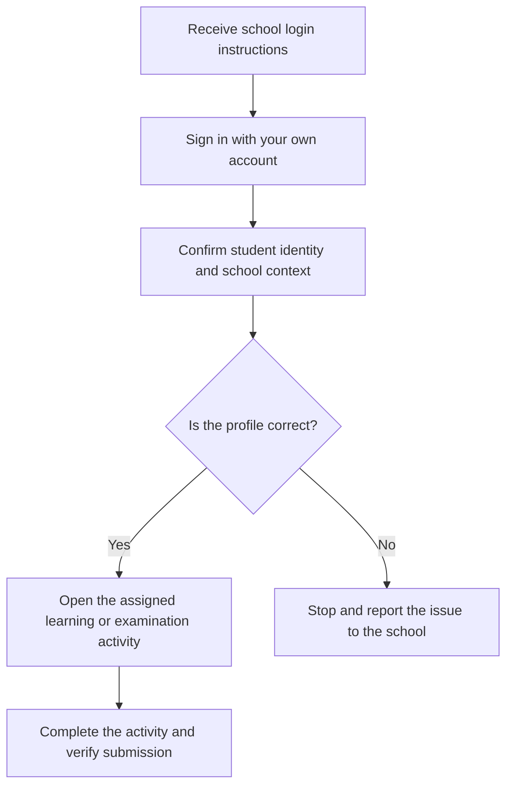

# Student Quick Start

This guide helps students use EduEdge safely without exposing administration or setup complexity.

## Before you begin

Confirm that the account belongs to you and that your displayed name, school, campus, class, and programme are correct. Do not continue with examination or result work under another student’s profile.

## Student access flow

## Safe account use

- Keep your password private.
- Sign out on shared computers.
- Do not send your login or examination link to another student.
- Do not create another account because access is missing.
- Use the school’s official support route for corrections.

## Finding your work

Your school may direct you to CBT, learning content, results, report cards, or another student-facing page. Follow only the links and instructions issued by the school. Administrative pages may not be available to student accounts.

## When to ask for help

Ask the school administrator when:

- your name, class, branch, programme, or student number is wrong;
- an examination you were assigned does not appear;
- you see another student’s information;
- a result expected to be published is not available;
- the system says you do not have permission.

## Practice Exercise

- Sign in using your own account.
- Confirm your displayed identity.
- Explain why you should not create a second account.
- Identify the school contact responsible for correcting student records.
