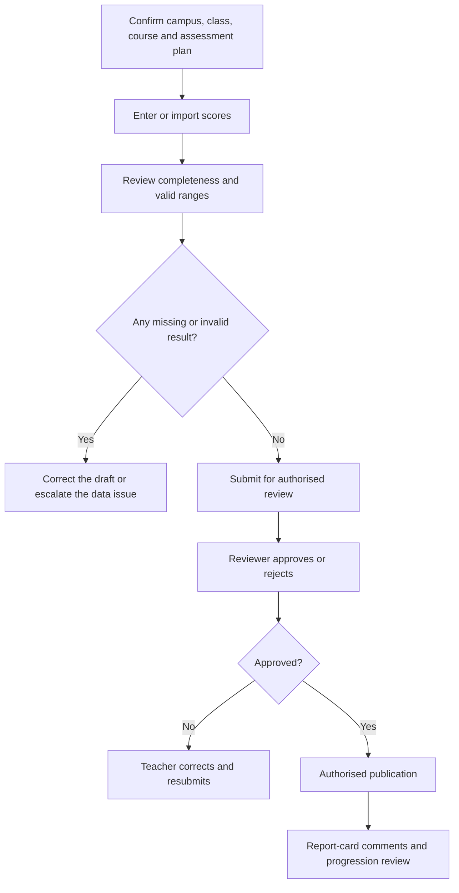

# Assessments, Results and Report-Card Handoffs

Teachers prepare and enter academic evidence; authorised reviewers control approval and publication. EduEdge keeps these responsibilities separate so incomplete or unreviewed results do not become official.

## Assessment and result flow

## Confirm the assessment plan

Before entering scores, verify the academic year, term, branch, class, course, grading scale, maximum score, and assessment dates. A correct student list with the wrong assessment context is still wrong data.

## Enter complete results

- Use only the permitted students for the selected class and campus.
- Resolve missing or duplicate learners before submission.
- Check out-of-range and obviously incorrect scores.
- Save drafts while working.
- Never alter a submitted result outside the approved correction workflow.

## Approval and publication

Teachers should not assume that result entry equals publication. An authorised reviewer may approve, reject, or request correction. Publication should occur only after completeness checks and approval.

## Report-card comments

Comments should be factual, respectful, useful, and based on approved academic evidence. Progression or promotion recommendations remain subject to authorised review.

## Practice Exercise

- Open an assessment plan and identify its branch, class, course, and grading basis.
- Describe the checks required before submitting results.
- Explain the difference between result entry, approval, and publication.
- Draft one factual teacher comment that avoids unsupported judgement.
