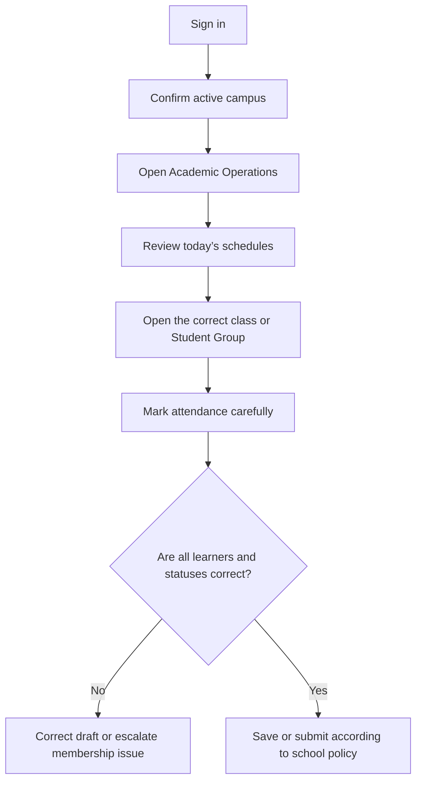

# Teacher Daily Operations

Teachers should work only inside the campus, class, course, and schedule assigned to them. EduEdge filtering helps prevent mistakes, but the teacher must still confirm context before saving or submitting.

## Daily workflow

## Confirm the active campus

A teacher assigned to more than one campus must confirm the active branch before opening schedules, attendance, or assessment work. Changing branch context affects the records and options shown across EduEdge.

## Review schedules

Check:

- class or Student Group;
- course or subject;
- room;
- date and time;
- assigned teacher;
- campus.

Do not mark attendance from an unrelated schedule or class.

## Mark attendance

1. Open the correct class register.
2. Confirm every student belongs to the class.
3. Record the correct attendance status.
4. Review the full list before submission.
5. Correct a draft when needed; do not try to rewrite a protected submitted record.

## Escalate data problems

Contact the school administrator when a student is missing, duplicated, in the wrong class, assigned to the wrong campus, or linked to an incorrect programme. Do not create another student record as a shortcut.

## Practice Exercise

- Activate the campus assigned by your trainer.
- Open Academic Operations and identify today’s schedule.
- Explain what you would do if a learner is missing from the class register.
- Demonstrate the review you perform before submitting attendance.
